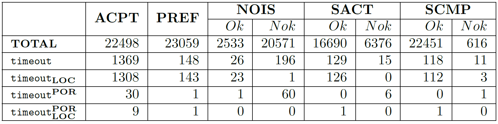
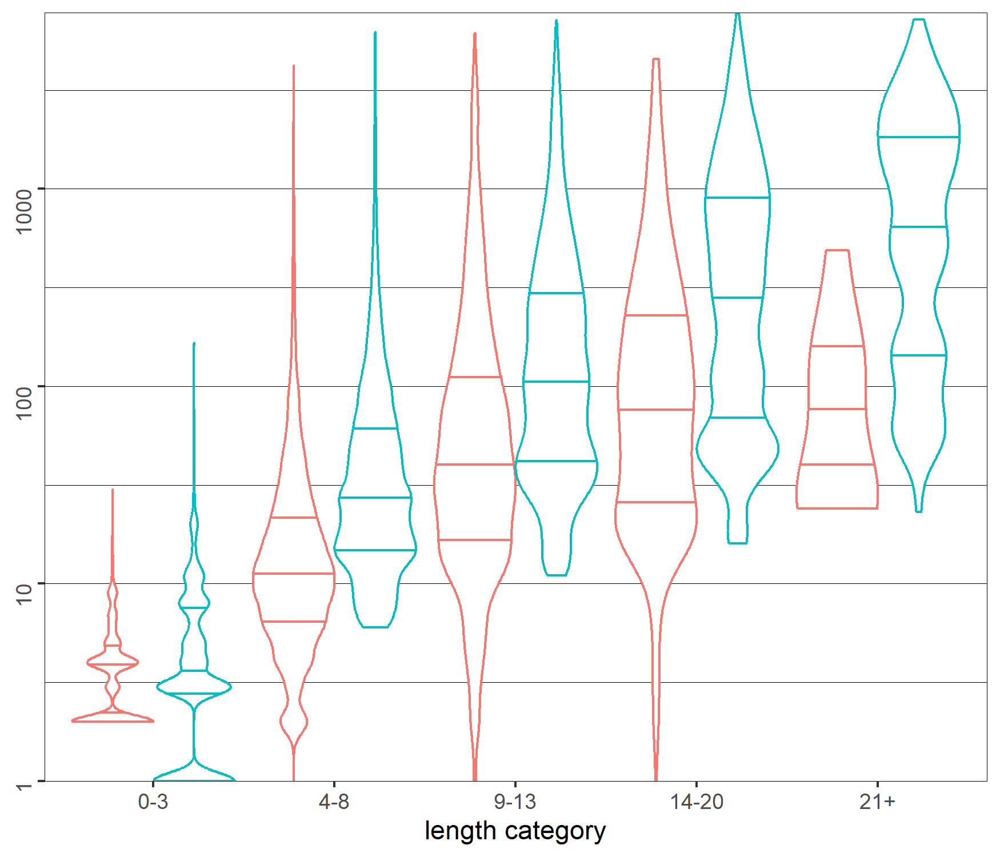
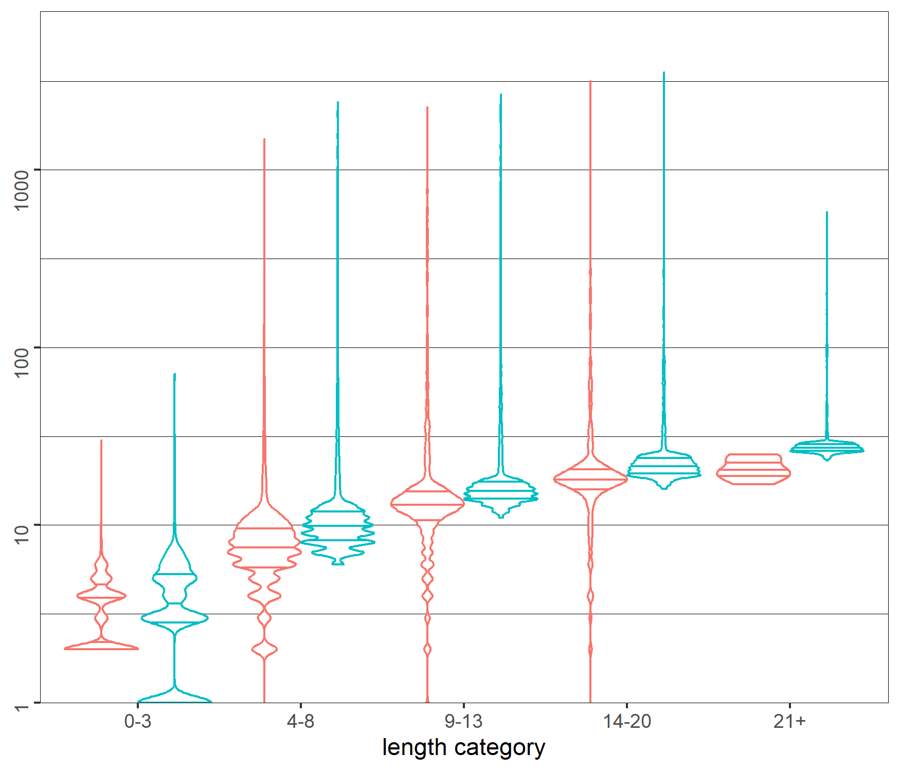
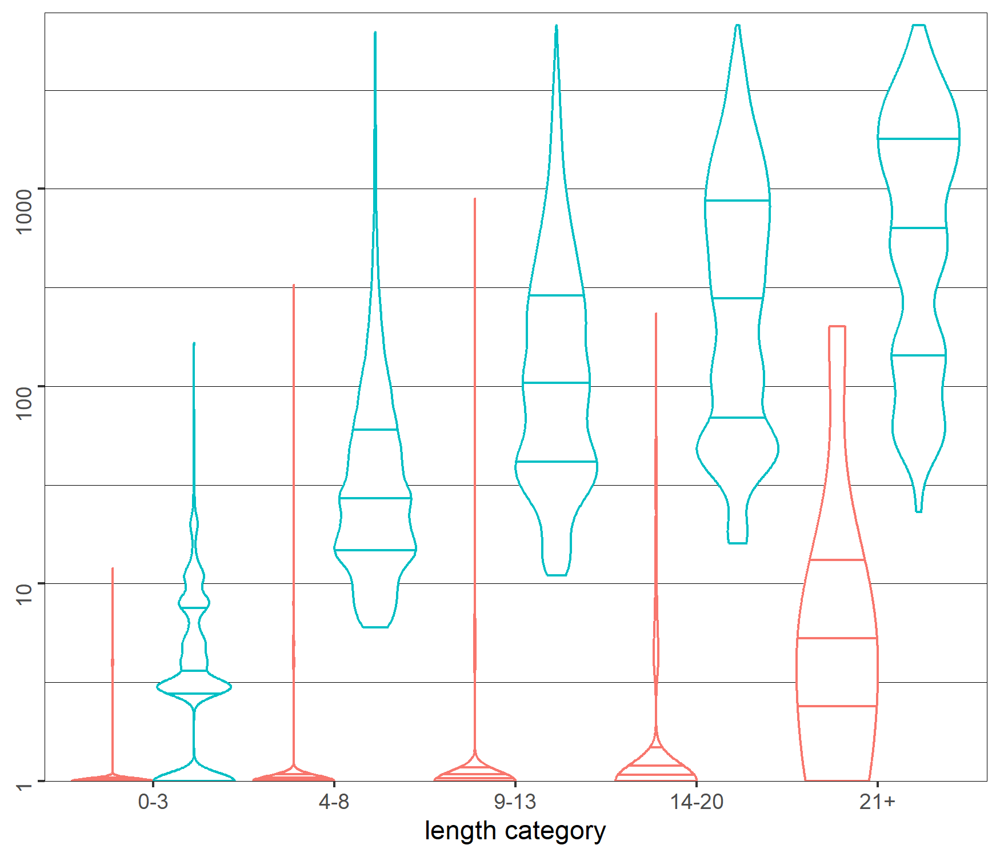
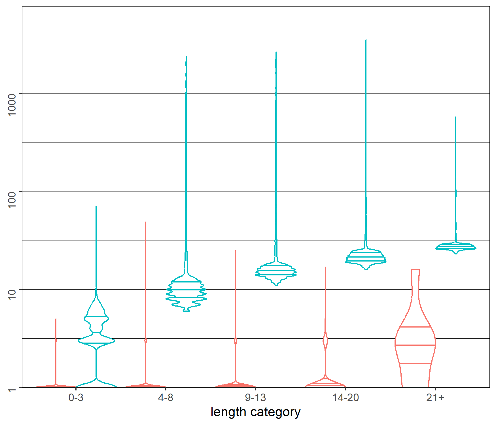

# Experimental evaluation of the size of analysis graphs for HIBOU's multi-trace analysis algorithm with lifeline removal steps

This set of experiments constitutes an evaluation of techniques which aim is to reduce the size of a graph.
This graph, that we call the analysis graph is defined so that finding a path in that graph
from a vertex *(i,mu)* where *i* is an interaction model and *mu* a multi-trace 
towards a specific *Ok* verdict vertex 
amounts to verifying the validity of the behavior described by *mu* with regards to the specification that *i* defines.

This can be used for Offline Runtime Verification of Distributed Systems, indeed:
- *mu* describes a distributed behavior as a collection of locally observed behaviors
 (e.g., a set of log files, one per local machine).
- *i* constitutes a formal specification for a Distributed System (akin to UML Sequence Diagrams or Message Sequence Charts)

Algorithms that exploit this graph definition for Offline Runtime Verification are implemented 
in "[hibou_label](https://github.com/erwanM974/hibou_label)".
We perform the following experiments on that tool.

## The two techniques

We consider 2 techniques to reduce the size of the graph:
- a technique of Partial Order Reduction (POR) which relies on the identification of one-unambiguous actions that
can be safely selected as a unique start event for linearization
- a technique of LOCal analyses (LOC) which relies on analyzing each local component of the multi-trace independently

As we aim at comparing the effect of these two approaches on our baseline graph size, we compare 4 metrics:
- the size of the original graph
- the size of the graph obtained using POR alone
- the size of the graph obtained using LOC alone
- the size of the graph obtained using POR and LOC

## The input dataset

As input data, we use a large benchmark obtained as follows:
- We randomly generate *100* distinct interaction terms on a signature with *5* lifelines and *6* messages. 
This random generation proceeds inductively, drawing a random symbol of the Interaction Language (IL). 
If that symbol is a constant (empty interaction or an atomic action) then the process returns. 
Otherwise it is called recursively to generate the subterms of the unary or binary operator symbol.
We require a minimum term depth of *6* and a minimum total number of symbols (after term simplification) of *20*.
All symbols of the IL are included (including weakly sequential loops).

Then, for each of these *100* interactions, we generate:
- *240* random accepted multi-traces of sizes between *1* and *30*
- *240* random multi-prefixes, one for each of the *240* multi-traces
- *240* ``noise`` mutants, obtained via inserting a random action in one of the *240* multi-prefixes
- *240* ``swap action`` mutants, obtained via interverting the order of two actions on a local trace component of one of the *240* multi-prefixes
- *240* ``swap component`` mutants, obtained via interverting two components on the same lifeline from two distinct multi-prefixes

In practice, we have generated *114 794* unique datapoints.

## The timeouts

We performed the experiments on an Intel(R) Core(TM) i5-6360U CPU (2.00GHz) with 8GB RAM with HIBOU version 0.8.7.
We set a $3$ seconds timeout for the traversal of the graph.

The table above presents results related to the timeouts in a table.
Its columns correspond to the type of multi-trace that is involved, full multi-traces, multi-prefixes, the three three kinds of mutants (further divided into those that are still within the multi-prefix semantics of the corresponding interaction and those that are not).
The first row counts the total number of data points (whether or not there has been a timeout using any method).
The second row counts the number of timeouts when exploring the baseline graph without additional techniques.
For the third, fourth and fifth it is when exploring it using POR and LOC as indicated in the row name.

We observe that the overall number of timeouts consequently decreases whenever we use the partial order reduction POR technique (two last rows), whether or not we use local analyses LOC.
The number of timeouts decrease when using local analyses LOC only when considering multi-traces that are *Nok* (i.e. that describe an incorrect behavior w.r.t. the spec).
 This is particularly the case when considering ``noise`` *Nok* multi-traces, whether or not we also use partial order reduction.

## The graph size

|          | no POR                                      | with POR                                    |
|----------|---------------------------------------------|---------------------------------------------|
| no LOC   |  |  | 
| with LOC |  |  |

The diagrams above compare the distributions of graph sizes on our dataset depending on the method that is used 
(with or without POR and LOC) and the kind of multi-trace (by length and verdict).
To have a fair comparison, we only consider datapoints that didn't return a timeout with any of the four methods.
This amounts to *112 755* unique datapoints.

We present the results on a double entry table.
The two columns ''no POR'' and ''with POR''' correspond to the non-use and use of the Partial Order Reduction technique
while the two rows ''no LOC'' and ''with LOC''' refer to the Local Analysis technique.

On each cell, we represent statistical distributions of graph sizes from our dataset via violin plots.
The *y* axis corresponds to the graph size and is in logarithmic (base 10) scale.
These distributions are further divided according to whether or not the multi-trace is a correct prefix 
(via the blue and red colors) and according to the size of the multi-trace 
(we gather them into groups per length category, which correspond to the *x* axis).
Derived from classical box-plots, these diagrams also represent the density around values in the fashion of kernel density plots.
The wider the violin is at a certain *y* value, the more there are data points in its neighborhood
We use an additional scaling option so that all violins have the same maximal width, 
see [ggplot doc](https://ggplot2.tidyverse.org/reference/geom_violin.html).
The 3 horizontal lines correspond, from bottom to top to the 1st quartile, median and 3rd quartile.

We observe that the effect of POR is to globally reduce graph size. 
The maximal values are always reduced but the statistical effect is most important on the median value of graph sizes, 
which seem to follow a linear curve (in log 10 scale) with POR and an exponential curve without.
This change in the shape of the distribution is most visible without local analyses 
and on *Ok* traces with local analyses (they appear packed at the bottom, around the median value).

The effect of LOC is very impressive when considering *Nok* verdict multi-traces. 
This is not surprising in the case of ``noise`` *Nok* multi-traces as there can be an immediate failure of local analysis 
at the start, from the initial vertex, the graph then being of size *1*.
However, for longer multi-traces (length category 14-20 and 21+), a distinct effect can be observed as the graph size 
is consequently reduced but without reaching a graph size of *1*.
Indeed, LOC enables avoiding parts of the graph following a wrong choice that has been made 
(e.g., the choice of a branch of an alternative, of instantiating a loop etc.).

## How to use

Use the "main.py" Python script to generate the raw data. It will:
- generate the 100 interactions
- for each interaction, generate 1200 traces
- for each of the 120 000 trace it will run the graph exploration using the 4 methods with a timeout of 3 secs
- for each of the 120 000 traces, it will create a row in a "results_graph.csv" CSV table

This process may take quite a long time (about 15 hours on a lower average 2020 era laptop).
Alternatively, you can use the precomputed data in "results_graph_saved.csv".
In the "graph_size_v3.zip" archive you also have all the intermediate artifacts 
(generated interaction and multi-trace files) that were used to generate "results_graph_saved.csv".

Once you have a CSV table named "results_graph.csv" you can run the R script "plot_partial_order_local_analyses.R".
It will print and plot relevant data found in the CSV file.

